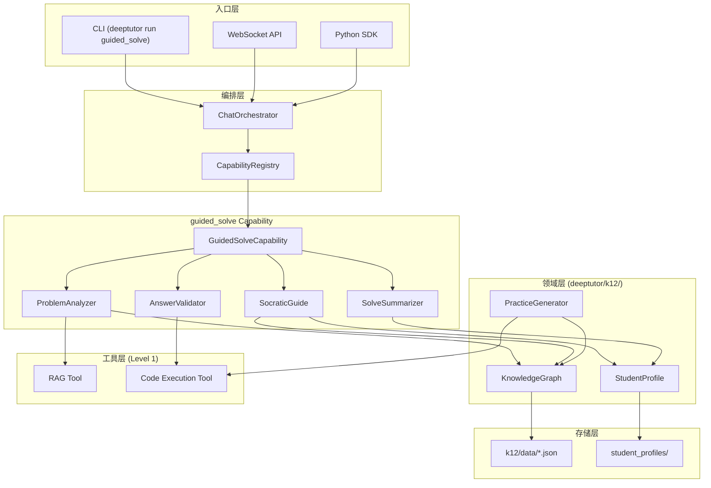

# 技术设计文档：K12 数学引导式辅导

## 概述

本设计文档描述 K12 数学引导式辅导（Guided Tutoring）功能的技术架构。该功能作为 DeepTutor 平台的一个新 Capability（`guided_solve`）实现，遵循现有的两层插件模型（Tools + Capabilities）。

核心设计原则：
- **代码与内容分离**：所有年级/教材相关内容由 JSON 数据文件驱动，代码层面完全年级无关
- **苏格拉底式引导**：系统通过分层提问引导学生自主解题，而非直接给出答案
- **自适应学习**：根据学生掌握度动态调整引导深度和练习难度
- **流式架构**：全程通过 StreamBus 输出事件，支持前端实时展示

## 架构

### 高层架构



### 模块划分

```
deeptutor/k12/
├── __init__.py
├── models.py                  # 领域数据模型 (Pydantic)
├── knowledge_graph.py         # 知识图谱加载与查询
├── student_profile.py         # 学生画像管理与持久化
├── practice_generator.py      # 自适应练习生成
├── data/                      # 知识库 JSON 数据（按年级/学期组织）
│   ├── __init__.py
│   └── README.md              # 数据格式说明
└── agents/
    ├── __init__.py
    ├── problem_analyzer.py    # 题目分析与知识点识别
    ├── socratic_guide.py      # 苏格拉底式引导引擎
    ├── answer_validator.py    # 答案验证
    ├── solve_summarizer.py    # 解题总结生成
    └── prompts/               # LLM 提示词模板
        ├── analyze.py
        ├── guide.py
        ├── validate.py
        └── summarize.py

deeptutor/capabilities/
└── guided_solve.py            # Capability 入口（编排各 agent）

```

## 组件与接口

### 1. GuidedSolveCapability（能力入口）

作为 `BaseCapability` 子类，负责编排整个引导式解题流程的四个阶段。

```python
# deeptutor/capabilities/guided_solve.py

from deeptutor.core.capability_protocol import BaseCapability, CapabilityManifest
from deeptutor.core.context import UnifiedContext
from deeptutor.core.stream_bus import StreamBus

class GuidedSolveRequestConfig(BaseModel):
    """请求配置"""
    model_config = ConfigDict(extra="forbid")
    guidance_mode: Literal["auto", "full", "moderate", "minimal"] = "auto"

class GuidedSolveCapability(BaseCapability):
    manifest = CapabilityManifest(
        name="guided_solve",
        description="K12 数学引导式辅导：苏格拉底式提问引导学生自主解题。",
        stages=["analyzing", "guiding", "validating", "summarizing"],
        tools_used=["rag", "code_execution"],
        cli_aliases=["guided_solve", "tutor"],
        request_schema=get_capability_request_schema("guided_solve"),
    )

    async def run(self, context: UnifiedContext, stream: StreamBus) -> None:
        """
        主流程编排：
        1. analyzing  - 解析题目，识别知识点
        2. guiding    - 苏格拉底式分步引导
        3. validating - 验证学生答案
        4. summarizing - 生成解题总结
        
        注意：guiding 和 validating 在多轮对话中交替进行。
        """
        ...
```

### 2. ProblemAnalyzer（题目分析器）

负责解析学生提交的数学题目，识别涉及的知识点，并从知识库检索相关教学内容。

```python
# deeptutor/k12/agents/problem_analyzer.py

@dataclass
class AnalysisResult:
    """题目分析结果"""
    problem_text: str                    # 原始题目文本
    knowledge_points: list[str]          # 识别到的知识点 ID 列表（按依赖序排列）
    difficulty_estimate: int             # 估计难度 1-5
    solution_steps: list[str]            # 预估解题步骤描述
    rag_context: str                     # RAG 检索到的教学内容
    has_image: bool                      # 是否包含图片

class ProblemAnalyzer:
    def __init__(self, knowledge_graph: KnowledgeGraph):
        self._kg = knowledge_graph

    async def analyze(
        self,
        problem_text: str,
        attachments: list[Attachment],
        kb_name: str | None,
        stream: StreamBus,
    ) -> AnalysisResult:
        """
        分析题目：
        1. 提取文本和图片中的数学信息
        2. 通过 LLM 识别涉及的知识点
        3. 通过 RAG 检索相关教学内容
        4. 按知识图谱依赖顺序排列知识点
        """
        ...

    def order_by_prerequisites(self, knowledge_point_ids: list[str]) -> list[str]:
        """按知识图谱前置依赖的拓扑序排列知识点"""
        ...
```

### 3. SocraticGuide（苏格拉底式引导引擎）

核心引导逻辑，根据学生掌握度和当前解题状态生成分层引导问题。

```python
# deeptutor/k12/agents/socratic_guide.py

class GuidanceLevel(str, Enum):
    FULL = "full"           # 完整引导：细粒度步骤 + 知识点提示
    MODERATE = "moderate"   # 适度引导：关键转折点提问
    MINIMAL = "minimal"     # 最少引导：仅在请求时提供方向

@dataclass
class GuidanceStep:
    """单步引导内容"""
    step_index: int
    question: str                    # 引导性问题
    hint: str                        # 知识点提示（full 级别时提供）
    expected_direction: str          # 期望的解答方向（内部使用，不展示给学生）
    knowledge_point_id: str          # 关联知识点

@dataclass
class GuidanceState:
    """引导会话状态（持久化在 conversation metadata 中）"""
    current_step: int = 0
    total_steps: int = 0
    completed_steps: list[int] = field(default_factory=list)
    error_count: dict[int, int] = field(default_factory=dict)  # step_index -> error_count
    guidance_level: GuidanceLevel = GuidanceLevel.FULL
    steps: list[GuidanceStep] = field(default_factory=list)
    independent_steps: list[int] = field(default_factory=list)  # 独立完成的步骤

class SocraticGuide:
    def __init__(self, knowledge_graph: KnowledgeGraph, student_profile: StudentProfile):
        self._kg = knowledge_graph
        self._profile = student_profile

    def determine_guidance_level(self, mastery_scores: list[float]) -> GuidanceLevel:
        """
        根据相关知识点的平均掌握度确定引导等级：
        - avg < 0.4  → full
        - 0.4 <= avg <= 0.7 → moderate
        - avg > 0.7  → minimal
        """
        ...

    async def generate_steps(
        self,
        analysis: AnalysisResult,
        guidance_level: GuidanceLevel,
        stream: StreamBus,
    ) -> list[GuidanceStep]:
        """根据分析结果和引导等级生成解题步骤"""
        ...

    async def provide_guidance(
        self,
        state: GuidanceState,
        student_message: str,
        stream: StreamBus,
    ) -> GuidanceState:
        """
        处理学生回答，提供下一步引导：
        - 正确 → 进入下一步
        - 错误 → 提供提示，error_count++
        - 连续3次错误 → 降低引导等级
        """
        ...

    def downgrade_guidance(self, state: GuidanceState, step_index: int) -> GuidanceLevel:
        """连续错误时降低引导等级"""
        ...
```

### 4. AnswerValidator（答案验证器）

使用 Code_Execution_Tool 验证学生答案的数学正确性。

```python
# deeptutor/k12/agents/answer_validator.py

@dataclass
class ValidationResult:
    """验证结果"""
    is_correct: bool
    method: Literal["code_execution", "llm_fallback"]
    feedback: str                    # 反馈信息（不含答案）
    error_direction: str             # 错误方向提示（仅错误时）
    code_output: str                 # 代码执行输出（调试用）

class AnswerValidator:
    async def validate(
        self,
        student_answer: str,
        expected_direction: str,
        step: GuidanceStep,
        stream: StreamBus,
    ) -> ValidationResult:
        """
        验证学生答案：
        1. 生成验证 Python 代码
        2. 通过 Code_Execution_Tool 执行
        3. 超时/失败时回退到 LLM 推理验证
        4. 通过 StreamBus 发送 tool_call/tool_result 事件
        """
        ...

    async def _code_verify(self, student_answer: str, step: GuidanceStep) -> ValidationResult:
        """代码执行验证路径"""
        ...

    async def _llm_fallback_verify(self, student_answer: str, step: GuidanceStep) -> ValidationResult:
        """LLM 推理验证回退路径"""
        ...
```

### 5. SolveSummarizer（解题总结器）

```python
# deeptutor/k12/agents/solve_summarizer.py

@dataclass
class SolveSummary:
    """解题总结"""
    response: str                        # 总结文本
    knowledge_points: list[str]          # 涉及知识点 ID
    mastery_updates: dict[str, float]    # 知识点 -> 掌握度变化
    steps_needing_help: list[int]        # 需要引导的步骤索引
    common_mistakes: list[str]           # 易错点提醒

class SolveSummarizer:
    async def summarize(
        self,
        state: GuidanceState,
        analysis: AnalysisResult,
        student_profile: StudentProfile,
        stream: StreamBus,
    ) -> SolveSummary:
        """
        生成解题总结：
        1. 回顾解题路径
        2. 标注需要引导的步骤
        3. 列出涉及知识点和易错点
        4. 计算掌握度更新
        5. 更新 Student_Profile
        """
        ...
```

### 6. KnowledgeGraph（知识图谱）

```python
# deeptutor/k12/knowledge_graph.py

class KnowledgeGraph:
    """
    知识图谱管理器。
    从 deeptutor/k12/data/ 目录加载 JSON 数据文件，
    提供知识点查询、依赖链检索和拓扑排序功能。
    """

    def __init__(self, data_dir: Path | None = None):
        self._nodes: dict[str, KnowledgePoint] = {}
        self._edges: dict[str, list[str]] = {}  # node_id -> prerequisite_ids

    def load(self, data_dir: Path) -> None:
        """从目录加载所有 JSON 数据文件"""
        ...

    def get_point(self, point_id: str) -> KnowledgePoint | None:
        """获取单个知识点"""
        ...

    def get_prerequisites_chain(self, point_id: str) -> list[str]:
        """获取完整前置依赖链（拓扑序）"""
        ...

    def topological_sort(self, point_ids: list[str]) -> list[str]:
        """对给定知识点集合按依赖关系拓扑排序"""
        ...

    def get_weak_points(self, profile: StudentProfile) -> list[str]:
        """获取学生薄弱知识点（mastery < 0.4）"""
        ...

    def is_dag(self) -> bool:
        """验证图结构为有向无环图"""
        ...
```

### 7. StudentProfile（学生画像）

```python
# deeptutor/k12/student_profile.py

class StudentProfile:
    """
    学生画像管理器。
    持久化存储学生的年级、教材版本和各知识点掌握度。
    """

    def __init__(self, storage_dir: Path | None = None):
        self._storage_dir = storage_dir

    def create_profile(
        self,
        student_id: str,
        grade: str,
        semester: str,
        textbook_version: str,
        knowledge_graph: KnowledgeGraph,
    ) -> StudentProfileData:
        """创建新学生画像，所有知识点 mastery 初始化为 0.0"""
        ...

    def load_profile(self, student_id: str) -> StudentProfileData | None:
        """加载学生画像"""
        ...

    def save_profile(self, profile: StudentProfileData) -> None:
        """持久化学生画像"""
        ...

    def update_mastery(
        self,
        profile: StudentProfileData,
        knowledge_point_id: str,
        completion_type: CompletionType,
    ) -> float:
        """
        更新掌握度：
        - INDEPENDENT: +0.15
        - GUIDED: +0.08
        - FAILED: -0.05
        结果限制在 [0.0, 1.0]
        """
        ...

    def get_learning_report(self, profile: StudentProfileData) -> LearningReport:
        """生成学习报告：按 mastery 升序排列，标记薄弱项"""
        ...
```

### 8. PracticeGenerator（自适应练习生成器）

```python
# deeptutor/k12/practice_generator.py

class PracticeGenerator:
    """
    自适应练习生成器。
    根据学生画像生成针对性练习题集。
    """

    def __init__(self, knowledge_graph: KnowledgeGraph):
        self._kg = knowledge_graph

    async def generate_practice_set(
        self,
        profile: StudentProfileData,
        count: int = 10,
    ) -> list[PracticeProblem]:
        """
        生成练习题集：
        - 70% 薄弱知识点
        - 20% 复习巩固
        - 10% 挑战提升
        """
        ...

    def select_knowledge_points(
        self,
        profile: StudentProfileData,
        count: int,
    ) -> tuple[list[str], list[str], list[str]]:
        """按比例选择薄弱/复习/挑战知识点"""
        ...

    def adjust_difficulty(
        self,
        current_difficulty: int,
        consecutive_correct: int,
        consecutive_wrong: int,
    ) -> int:
        """
        调整难度：
        - 连续3次正确 → +1
        - 连续2次错误 → -1
        难度范围 [1, 5]
        """
        ...

    async def validate_answer(self, problem: PracticeProblem) -> bool:
        """使用 Code_Execution_Tool 验证参考答案正确性"""
        ...
```

## 数据模型

```python
# deeptutor/k12/models.py

from __future__ import annotations
from dataclasses import dataclass, field
from enum import Enum
from typing import Any
from pydantic import BaseModel, Field

# ─── 知识图谱模型 ───────────────────────────────────────────────

class KnowledgePoint(BaseModel):
    """知识点数据结构"""
    id: str                                    # 唯一标识符，如 "algebra.linear_eq.one_var"
    name: str                                  # 名称，如 "一元一次方程"
    grade: str                                 # 年级，如 "7" (代码不硬编码具体值)
    semester: str                              # 学期，如 "1"
    chapter: str                               # 所属章节
    difficulty: int = Field(ge=1, le=5)        # 难度等级 1-5
    prerequisites: list[str] = Field(default_factory=list)  # 前置知识点 ID
    common_mistakes: list[str] = Field(default_factory=list)  # 常见错误
    example_templates: list[ExampleTemplate] = Field(default_factory=list)  # 示例题目模板
    tags: list[str] = Field(default_factory=list)  # 标签（用于检索）

class ExampleTemplate(BaseModel):
    """题目模板"""
    template_text: str              # 模板文本，含占位符如 {a}, {b}
    variable_ranges: dict[str, Any] = Field(default_factory=dict)  # 变量范围
    solution_template: str = ""     # 解答模板
    difficulty: int = Field(ge=1, le=5, default=3)

# ─── 学生画像模型 ───────────────────────────────────────────────

class CompletionType(str, Enum):
    INDEPENDENT = "independent"    # 独立完成
    GUIDED = "guided"              # 引导完成
    FAILED = "failed"              # 未能完成

class MasteryRecord(BaseModel):
    """单个知识点的掌握记录"""
    knowledge_point_id: str
    score: float = Field(ge=0.0, le=1.0, default=0.0)
    last_updated: float = 0.0
    attempt_count: int = 0

class StudentProfileData(BaseModel):
    """学生画像数据"""
    student_id: str
    grade: str
    semester: str
    textbook_version: str
    mastery: dict[str, MasteryRecord] = Field(default_factory=dict)
    created_at: float = 0.0
    updated_at: float = 0.0

class LearningReport(BaseModel):
    """学习报告"""
    student_id: str
    knowledge_points: list[MasteryRecord]    # 按 score 升序排列
    weak_points: list[str]                   # score < 0.4 的知识点 ID
    total_points: int
    average_mastery: float

# ─── 练习题模型 ───────────────────────────────────────────────

class PracticeProblem(BaseModel):
    """练习题"""
    problem_text: str
    knowledge_points: list[str]
    difficulty: int = Field(ge=1, le=5)
    reference_answer: str
    category: Literal["weak", "review", "challenge"] = "weak"

# ─── 解题会话状态模型 ───────────────────────────────────────────

class SolvingSessionState(BaseModel):
    """解题会话状态（序列化到 conversation metadata）"""
    problem_text: str = ""
    analysis_result: dict[str, Any] = Field(default_factory=dict)
    current_step: int = 0
    total_steps: int = 0
    completed_steps: list[int] = Field(default_factory=list)
    error_count: dict[str, int] = Field(default_factory=dict)  # "step_{i}" -> count
    guidance_level: str = "full"
    steps: list[dict[str, Any]] = Field(default_factory=list)
    independent_steps: list[int] = Field(default_factory=list)
    is_complete: bool = False
    is_abandoned: bool = False
```

### 知识图谱 JSON 数据格式

```json
// deeptutor/k12/data/grade7_semester1.json (示例)
{
  "metadata": {
    "grade": "7",
    "semester": "1",
    "textbook_version": "人教版",
    "last_updated": "2024-01-01"
  },
  "knowledge_points": [
    {
      "id": "rational_numbers.concept",
      "name": "有理数的概念",
      "grade": "7",
      "semester": "1",
      "chapter": "第一章 有理数",
      "difficulty": 1,
      "prerequisites": [],
      "common_mistakes": [
        "将0归类为正数或负数",
        "混淆有理数和无理数的定义"
      ],
      "example_templates": [
        {
          "template_text": "判断下列数中哪些是有理数：{a}, √{b}, {c}/{d}, π",
          "variable_ranges": {"a": [-10, 10], "b": [2, 20], "c": [-5, 5], "d": [1, 9]},
          "solution_template": "{a} 和 {c}/{d} 是有理数",
          "difficulty": 1
        },
        {
          "template_text": "在数轴上表示有理数 {a}/{b}",
          "variable_ranges": {"a": [-8, 8], "b": [2, 6]},
          "solution_template": "在数轴上找到 {a}/{b} = {result} 的位置",
          "difficulty": 2
        },
        {
          "template_text": "比较有理数 {a}/{b} 和 {c}/{d} 的大小",
          "variable_ranges": {"a": [-5, 5], "b": [1, 6], "c": [-5, 5], "d": [1, 6]},
          "solution_template": "通分后比较分子大小",
          "difficulty": 2
        }
      ],
      "tags": ["有理数", "数的分类"]
    }
  ]
}
```


## 正确性属性 (Correctness Properties)

*正确性属性是在系统所有有效执行中都应成立的特征或行为——本质上是对系统应做什么的形式化陈述。属性是人类可读规格说明与机器可验证正确性保证之间的桥梁。*

### Property 1: 知识点拓扑排序保持依赖序

*For any* 知识图谱中的知识点子集，对其进行拓扑排序后，结果中任意两个知识点 A 和 B，若 A 是 B 的前置依赖，则 A 必须出现在 B 之前。

**Validates: Requirements 2.4**

### Property 2: 掌握度到引导等级的映射正确性

*For any* 有效的掌握度分数（0.0 到 1.0 之间的浮点数），`determine_guidance_level` 函数应返回正确的引导等级：分数低于 0.4 返回 `full`，0.4 到 0.7 之间返回 `moderate`，高于 0.7 返回 `minimal`。

**Validates: Requirements 3.1**

### Property 3: 连续错误触发引导等级降低

*For any* 解题步骤和引导状态，当某步骤的连续错误计数达到 3 时，该步骤的引导等级应降低（moderate → full，或 full 级别下提供更详细的提示）。

**Validates: Requirements 3.6**

### Property 4: 学生画像持久化往返一致性

*For any* 有效的 `StudentProfileData` 对象，将其序列化保存后再加载，得到的对象应与原始对象在所有字段上相等。

**Validates: Requirements 5.2**

### Property 5: 掌握度更新公式与边界约束

*For any* 当前掌握度分数和完成类型（independent/guided/failed），`update_mastery` 函数应正确应用增量（+0.15/+0.08/-0.05），且结果始终限制在 [0.0, 1.0] 范围内。

**Validates: Requirements 5.3, 5.4**

### Property 6: 学习报告按掌握度升序排列且正确标记薄弱项

*For any* 包含多个知识点掌握记录的学生画像，`get_learning_report` 返回的知识点列表应按 `score` 升序排列，且所有 score < 0.4 的知识点都被包含在 `weak_points` 列表中。

**Validates: Requirements 5.5**

### Property 7: 知识图谱为有向无环图

*For any* 从数据文件加载的知识图谱，其前置依赖关系不应包含环路（即拓扑排序必须成功）。

**Validates: Requirements 6.2**

### Property 8: 依赖链包含所有传递前置知识点

*For any* 知识图谱中的知识点，`get_prerequisites_chain` 返回的依赖链应包含该知识点的所有直接和间接前置知识点，且不包含知识点自身。

**Validates: Requirements 6.4**

### Property 9: 练习题集分布比例正确

*For any* 包含薄弱知识点的学生画像，生成的练习题集中薄弱知识点题目占比应约为 70%（±10%容差），复习巩固约 20%（±10%），挑战提升约 10%（±10%），前提是题集数量足够大（≥10题）。

**Validates: Requirements 7.1**

### Property 10: 难度调整遵循连续答题规则

*For any* 当前难度等级（1-5），连续 3 次正确应使难度 +1（上限为 5），连续 2 次错误应使难度 -1（下限为 1）。

**Validates: Requirements 7.3, 7.4**

### Property 11: 练习题结构完整性

*For any* 由 `PracticeGenerator` 生成的练习题，必须包含非空的 `problem_text`、至少一个 `knowledge_points`、有效的 `difficulty`（1-5）和非空的 `reference_answer`。

**Validates: Requirements 7.5**

### Property 12: 解题状态序列化往返一致性

*For any* 有效的 `SolvingSessionState` 对象，将其序列化为 JSON 后再反序列化，得到的对象应与原始对象相等。

**Validates: Requirements 8.2**

### Property 13: 解题总结包含所有必要信息

*For any* 已完成的解题会话（所有步骤已完成），生成的 `SolveSummary` 应包含非空的 `response`、非空的 `knowledge_points` 列表、`mastery_updates` 字典，且 `steps_needing_help` 应准确反映引导状态中非独立完成的步骤。

**Validates: Requirements 9.1, 9.2, 9.3**

### Property 14: 进度事件包含正确的步骤信息

*For any* 多步骤解题过程中的进度事件，`current_step` 应在 [0, total_steps) 范围内，且 `total_steps` 应大于 0。

**Validates: Requirements 10.4**

## 错误处理

### 错误分类与处理策略

| 错误场景 | 处理策略 | StreamBus 事件 |
|---------|---------|---------------|
| 题目无法识别知识点 | 回退到通用引导模式，不使用知识图谱 | `progress("无法精确识别知识点，使用通用引导")` |
| RAG 检索失败 | 继续引导但不提供教材参考 | `progress("知识库检索暂时不可用")` |
| Code_Execution_Tool 超时 | 回退到 LLM 推理验证 | `tool_result(method="llm_fallback")` |
| Code_Execution_Tool 执行错误 | 回退到 LLM 推理验证 | `error("代码验证失败，使用推理验证")` |
| 学生画像加载失败 | 创建临时画像，不持久化 | `progress("使用临时学习记录")` |
| 知识图谱数据文件格式错误 | 跳过错误文件，记录警告日志 | 无（启动时处理） |
| LLM 调用失败 | 重试一次，仍失败则返回通用错误消息 | `error("服务暂时不可用，请稍后重试")` |
| 学生输入非数学内容 | 礼貌提示回到数学题目 | `content("让我们回到数学题目...")` |

### 关键错误处理代码模式

```python
async def _validate_with_fallback(
    self,
    student_answer: str,
    step: GuidanceStep,
    stream: StreamBus,
) -> ValidationResult:
    """带回退的答案验证"""
    try:
        result = await asyncio.wait_for(
            self._code_verify(student_answer, step),
            timeout=30.0,
        )
        return result
    except (asyncio.TimeoutError, Exception) as exc:
        logger.warning("Code verification failed: %s, falling back to LLM", exc)
        await stream.progress(
            message="代码验证超时，使用推理验证",
            source="guided_solve",
            stage="validating",
        )
        return await self._llm_fallback_verify(student_answer, step)
```

## 测试策略

### 属性测试 (Property-Based Testing)

使用 **Hypothesis** 库实现属性测试，每个属性测试运行至少 100 次迭代。

**测试配置：**
```python
from hypothesis import given, settings, strategies as st

@settings(max_examples=100)
```

**属性测试覆盖范围：**

| Property | 测试目标 | 生成策略 |
|----------|---------|---------|
| Property 1 | `topological_sort` | 随机 DAG + 随机节点子集 |
| Property 2 | `determine_guidance_level` | `st.floats(0.0, 1.0)` |
| Property 3 | `downgrade_guidance` | 随机 GuidanceState + error_count=3 |
| Property 4 | `save_profile` / `load_profile` | 随机 StudentProfileData |
| Property 5 | `update_mastery` | `st.floats(0.0, 1.0)` × CompletionType |
| Property 6 | `get_learning_report` | 随机 mastery 字典 |
| Property 7 | `is_dag` | 随机图结构（含/不含环） |
| Property 8 | `get_prerequisites_chain` | 随机 DAG + 随机节点 |
| Property 9 | `generate_practice_set` | 随机 StudentProfileData |
| Property 10 | `adjust_difficulty` | `st.integers(1,5)` × 连续计数 |
| Property 11 | `generate_practice_set` 输出 | 随机生成结果 |
| Property 12 | `SolvingSessionState` 序列化 | 随机 SolvingSessionState |
| Property 13 | `summarize` | 随机完成状态 |
| Property 14 | progress 事件 | 随机步骤数 |

**标签格式：**
```python
# Feature: k12-math-guided-tutoring, Property 5: 掌握度更新公式与边界约束
```

### 单元测试 (Example-Based)

| 测试场景 | 验证内容 |
|---------|---------|
| 图片附件题目分析 | 验证图片信息提取与文本结合 |
| full 级别引导输出 | 验证细粒度步骤和知识点提示 |
| moderate 级别引导输出 | 验证仅关键转折点提问 |
| minimal 级别引导输出 | 验证仅在请求时提供提示 |
| 正确答案确认流程 | 验证确认消息和步骤推进 |
| 错误答案提示流程 | 验证提示不含答案 |
| Code_Execution 超时回退 | 验证 LLM fallback 触发 |
| 放弃题目流程 | 验证进度保存和 mastery 更新 |
| StreamBus 事件序列 | 验证 STAGE_START/END 和 DONE 事件 |

### 集成测试

| 测试场景 | 验证内容 |
|---------|---------|
| 完整解题流程 | 端到端：分析 → 引导 → 验证 → 总结 |
| ChatOrchestrator 路由 | `active_capability="guided_solve"` 正确路由 |
| RAG 检索集成 | 知识点查询返回相关教学内容 |
| 多轮对话状态恢复 | 跨消息的状态持久化与恢复 |

### 测试工具选择

- **属性测试框架**: Hypothesis (Python)
- **单元测试框架**: pytest
- **Mock 工具**: pytest-mock / unittest.mock
- **异步测试**: pytest-asyncio
